<div align="center">
  
</div>

<br>

I'm a third-year ECE student at BMS Institute of Technology and Management (CGPA 8.8 after 5th semester). I'm aiming to become a **VLSI verification engineer** and I'm open to other hardware roles. I also design and build for the web, so most of my projects end where a signal reaches a screen.

```systemverilog
module arnav_paniya #(
  parameter BRANCH  = "ECE",
  parameter COLLEGE = "BMSIT&M",
  parameter YEAR    = 3
) (
  output logic hardware,
  output logic web
);
  initial $display("goal: verification engineer, VLSI");
  // training : SoC design (Elevium)
  // building : FPGA CNN accelerator for wafer defect detection
  assign hardware = 1'b1;
  assign web      = 1'b1;
endmodule
```




## Hardware

Where I worked on both sides of a project, the table says which side carried most of my work.

| Ref | Project | What it is | My part | Status |
| --- | --- | --- | --- | --- |
| U1 | Peripheral Configuration Distribution Controller | SoC design block from the Elevium training at BMSIT&M | Training project | In progress |
| U2 | FPGA CNN accelerator for wafer defect detection | Separable convolution turns K² multiplies per output pixel into 2K, aiming at lower latency and power. Xilinx toolchain | Team mini project | In progress |
| U3 | [SZK-AeroX](https://github.com/arnavpaniya/SZK-AeroX) | Search and rescue UAV. The repo holds the [3D project site](https://szkaerox.vercel.app) | Hardware and software, mostly software | Site live |
| U4 | [VantEdge RF noise mapper](https://github.com/arnavpaniya/rf-dashboard) | ESP32 sensor nodes feed a campus RF heatmap. Built with the IEEE AP-S BMSIT&M team | Hardware and software, mostly software: dashboard UI/UX | [Live](https://vantedge.vercel.app) |

<!-- TODO: link U1 and U2 repos once pushed, add a block diagram and testbench results -->

## Shipped on the web

| Ref | Project | What it is | Built with |
| --- | --- | --- | --- |
| J1 | DevsBazaar | Agency website, designed during my web developer internship | Next.js |
| J2 | ReWorks | Website for DevsBazaar's client, a digital marketing agency | Next.js |
| J3 | NIRMAAN 2026 | National 24-hour innovation challenge at BMSIT&M. I was on the technical team and built the event's digital experiences and the participant management dashboard | Web |
| J4 | [Ascendia](https://github.com/arnavpaniya/ascendia) ([live](https://ascendia-five.vercel.app)) | EdTech app with 3D visuals | Next.js, Three.js, Framer Motion |
| J5 | [MealLink](https://github.com/arnavpaniya/MealLink) ([live](https://meallink.vercel.app)) | Connects surplus food from PGs and restaurants to NGOs | Next.js, Tailwind |
| J6 | [RollCall](https://github.com/arnavpaniya/RollCall) ([live](https://rollcall-dashboard.vercel.app)) | QR based attendance with time-bound codes | Next.js, TypeScript |
| J7 | [EventSphere](https://github.com/arnavpaniya/EventSphere) ([live](https://eventsphere-ochre.vercel.app)) | Event management for organizers and participants | React, Firebase |
| J8 | [GreenByte](https://github.com/arnavpaniya/GreenByte) ([live](https://grenbyte.netlify.app/)) | E-waste pickup requests with an admin dashboard | Node, Express, MongoDB |

## Hackathons

I've taken part in 20+ hackathons and ideathons, both short and 24-hour formats. Most recent: **Smart India Hackathon 2026**, where my team built **ChandraVision**, AI-based lunar hazard mapping and safe landing site selection.

<!-- TODO: add ChandraVision repo link and result, list notable wins, list open-source contributions -->


## Find me

[Email](mailto:arnavpaniya@gmail.com) · [Portfolio](https://arnavpaniya.netlify.app/) · [LinkedIn](https://www.linkedin.com/in/arnav-paniya/) · [X](https://x.com/arnav_paniya) · [Instagram](https://www.instagram.com/arnav._.paniya/)
